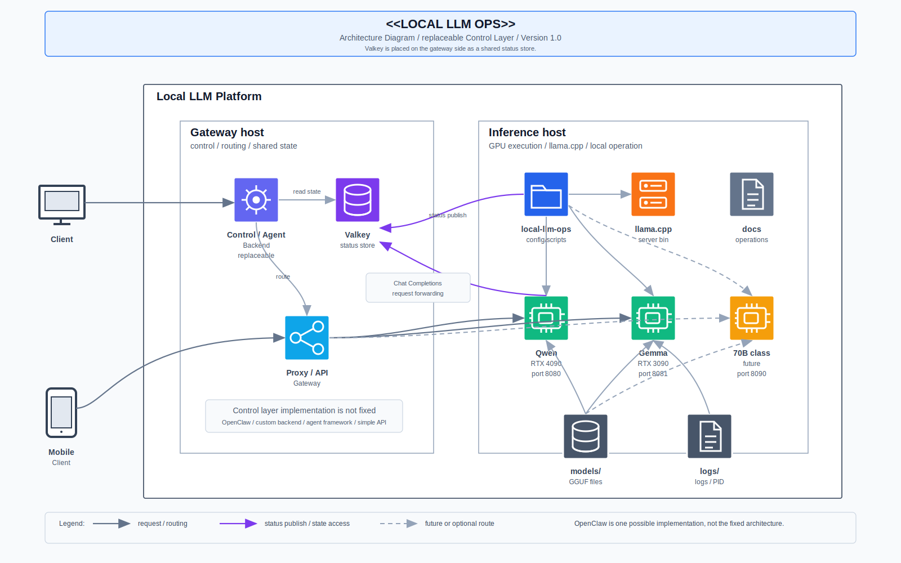

# アーキテクチャ

このドキュメントは、`local-llm-ops` の全体構成を説明する。

`local-llm-ops` は、推論ホスト上で `llama.cpp` server を安定運用するための管理レイヤーである。

- モデル設定
- 起動・停止
- healthcheck
- GPU 状態確認
- Valkey への状態 publish
- systemd による常駐化
- 70B 級モデルへの切替手順

を扱う。

## 全体構成図



## レイヤー構成

```text
Clients
  ↓
Gateway host
  - Control / Agent Backend
  - Valkey
  - Proxy / API gateway
  ↓
Inference host
  - local-llm-ops
  - llama.cpp
  - Qwen / Gemma / future 70B-class model
  - models / logs
```

## Gateway host

Gateway host は、外部からの問い合わせを受け取り、どの推論先へ送るかを判断する層である。

この層の実装は固定しない。

候補:

- OpenClaw
- custom backend
- agent framework
- simple API backend

図中では、この差し替え可能な層を `Control / Agent Backend` と表現する。

## Valkey

Valkey は Gateway host 側に配置する想定とする。

役割:

- モデル稼働状態の保持
- GPU 状態の保持
- `cluster_mode` の保持
- routing / fallback 判断のための共有状態ストア

Inference host は、自身の状態を Valkey に publish する。

Gateway host 側の Control / Agent Backend は、Valkey を参照して利用可能なモデルと routing 先を判断する。

## Inference host

Inference host は、GPU と `llama.cpp` server を使って実際の推論を実行する層である。

`local-llm-ops` はこの層で以下を担当する。

- `config/` によるモデル設定
- `scripts/` による起動・停止・監視
- `systemd/` による常駐化
- `docs/` による運用手順の管理
- `models/` 配下の GGUF モデル利用
- `logs/` 配下のログ・PID 管理

## モデル構成

通常運用では、2 つのモデルを単一 GPU に固定して運用する。

| model | GPU | port | role |
|---|---:|---:|---|
| Qwen3.6-35B-A3B | RTX 4090 | 8080 | 推論・コーディング寄り |
| Gemma 4 31B IT | RTX 3090 | 8081 | 文章・要約寄り |
| future 70B-class model | RTX 4090 + RTX 3090 | 8090 | 将来の高負荷推論 |

GPU 固定は `CUDA_VISIBLE_DEVICES` で行う。

単一 GPU 運用では、プロセスから見える GPU は 1 枚だけなので、`llama.cpp` 側では `--main-gpu 0` を使う。

## Control / Agent Backend の抽象化

この構成では、OpenClaw を固定アーキテクチャとはみなさない。

OpenClaw は Control / Agent Backend の一実装候補であり、将来的には別のエージェント基盤や単純なバックエンドに置き換えられる。

そのため、`local-llm-ops` 側は以下の境界を守る。

- routing policy を直接持たない
- モデル状態と GPU 状態を publish する
- Valkey のキー仕様を契約として維持する
- 推論 API は proxy / backend 側から呼ばれる前提にする

## 70B 切替

将来の 70B 級モデル運用では、通常の Qwen / Gemma の dual-single 運用を止め、2 GPU 分散の single-70b mode に切り替える。

切替時は、先に Valkey の `cluster_mode_override` を更新し、Control / Agent Backend が通常モデルを routing 候補から外せる状態にしてから、Qwen / Gemma を停止する。

詳細は `docs/70b-cutover.md` を参照する。
